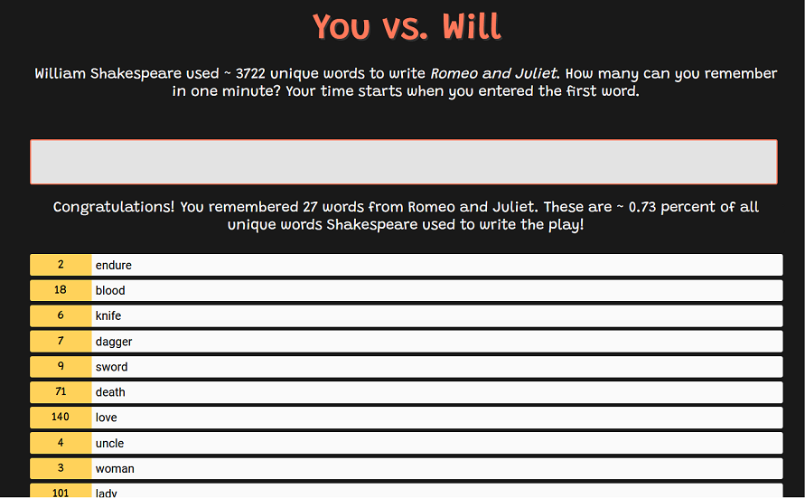

# You vs. Will

Test your word skill against the great barde! You have one minute to remember as many words as possible used by William Shakespeare to write *Romeo and Juliet*. 

## Usage

- Download repository 
- Run `npm install` to install dependencies for local test server
- Run `npm start`

---

# Erste Übungsaufgabe: You vs. Will

Die Anleitung zur Aufgabe (*Handout*) finden Sie [hier](https://multimedia-engineering.git-pages.uni-regensburg.de/mme-online/#/Aufgaben/index). 